# Introduction

Dans ce TP d'initation au traitement du signal, nous allons voir comment fonctionne la transformée de Fourier dans le cadre du débruitage d'un signal. Cette dernière permet notamment de calculer le spectre d'un signal, c'est à dire la représentation dans le domaine fréquentiel d'un signal sous la forme de somme de sinusoïdales d'une certaine fréquence et d'une certaine intensité. 

## Partie 1 : Convolution et Transformée de Fourier (TF d'une porte)

On crée un signal porte d'une durée de 1 seconde grâce à cette formule :  

$$s(t)= \begin{cases}
1 \text{ pour } -T/fe<=t<=T/fe\\
0 \text{ sinon}
\end{cases}$$

Avec fe = 1024Hz la fréquence d'échantillonage, T = 25 échantillons et t variant de -0,5 secondes à 0,5 secondes.

#### 1.

On trace le signal porte obtenu :  
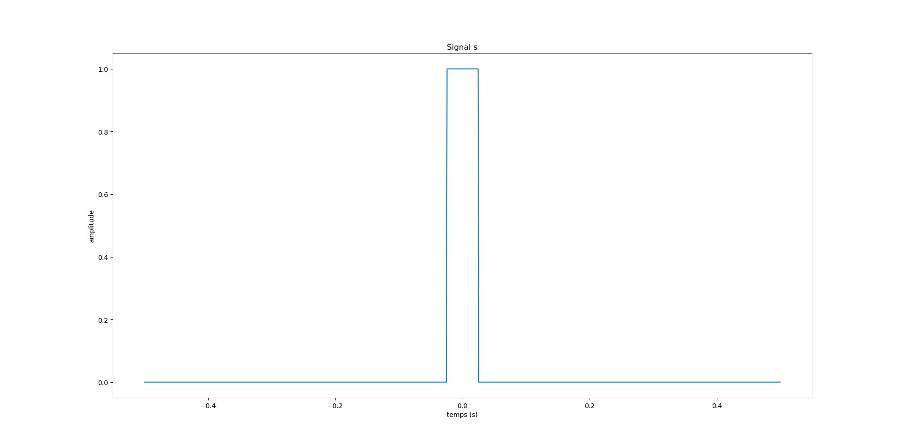

\newpage

#### 2.

On calcule l'axe des fréquences et on les déplace de manière centrée. On affiche le module (avec numpy.abs) et la phase de la FFT de s (avec numpy.angle):  
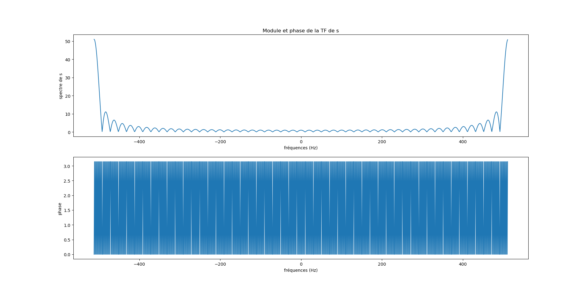

On semble bien obtenir le spectre de s, mais les fréquences semblent décalées. Pour une visualisation correcte du spectre, on doit décaler de manière centrée les fréquences.

#### 3.

On déplace de manière centrée la FFT de s et on affiche son module et sa phase :  
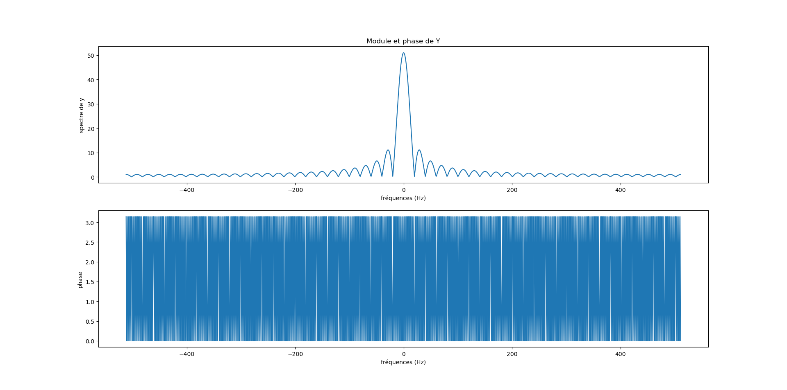

On semble obtenir quelque chose de plus cohérent. Il est intéressant de remarquer que l'on obtient comme une "somme infinitésimale" de sinusoïdales (on a une fréquence fondamentale de 0Hz). Cela doit certainement être dû au fait que le signal porte n'est pas périodique.

#### 4.

On calcule les FFT inverses de Y et S. On obtient les signaux suivants :  
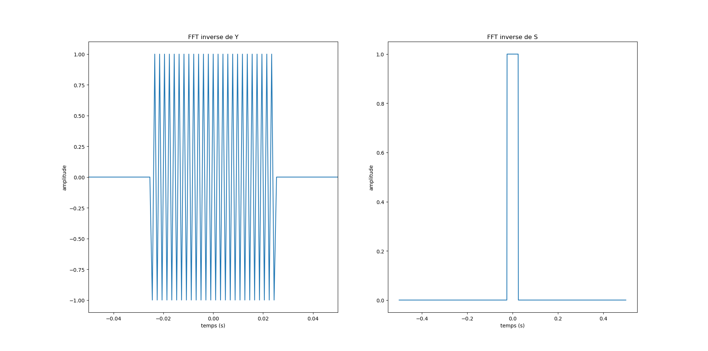

On retrouve le signal initial pour S, mais un signal différent pour Y. Cela semble logique car les fréquences sont décalées de même que pour la phase.

#### 5.

On calcule le produit de convolution $x = s*s$. On obtient la courbe suivante :  
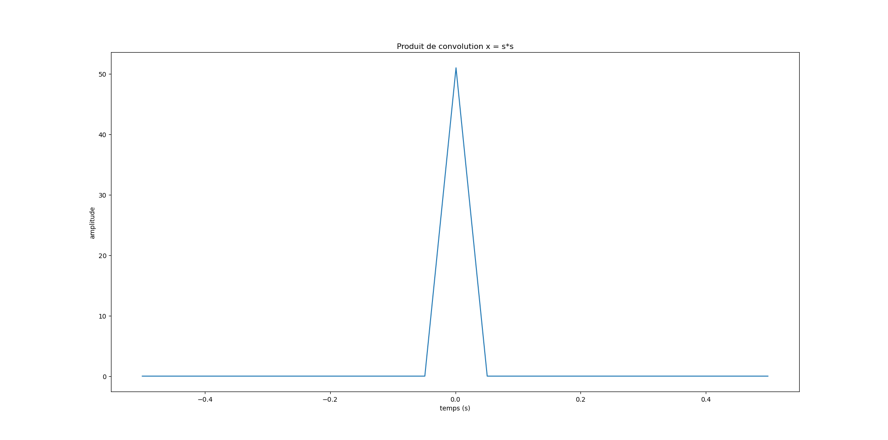

Comme vu en TD, en faisant le produit de convolution d'une porte par elle-même, on obtient un signal "triangle".

#### 6.

On calcule la FFT de x et le carré de la FFT de s et on affiche leur module pour les comparer :  
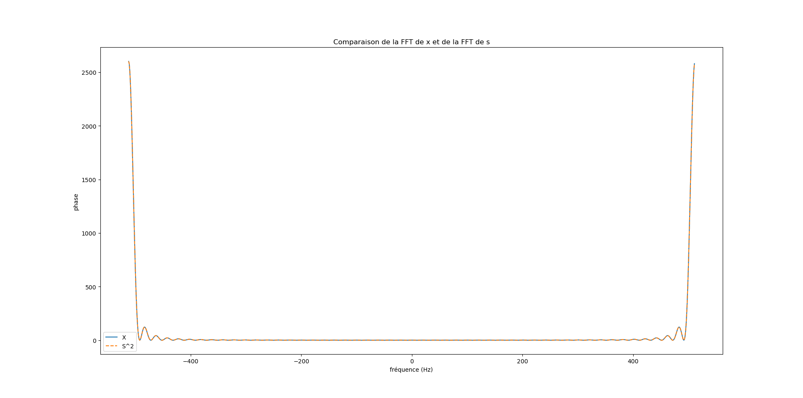

Comme vu en TD, le carré de la FFT de s est égal à la FFT de s convolution s en module, c'est le théorème de Plancherel.

$$x(t) = s(t) * s(t) \Leftrightarrow X(\mu) = S(\mu)^2$$

Avec $X = TF[x]$ et $S = TF[s]$

\newpage

## Partie 2 : TF d'un signal carré

#### 1.

On crée un signal carré d'une fréquence de 100Hz, sur 10 périodes (ce qui nous donne une durée de 0.1 secondes) avec une fréquence d'échantillonage fe = 1kHz en prenant le signe d'un signal sinusoidal (on utilise np.sign avec np.sin). On fait varier t de 0 à 1 secondes.

On obtient le signal suivant :  
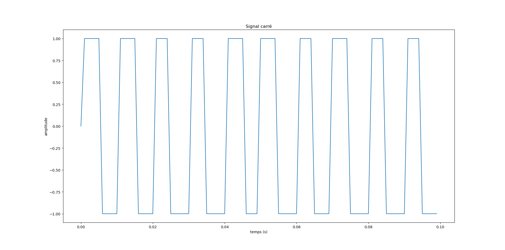

Le signal carré n'est pas parfait ce qui est certainement dû à la fréquence d'échantillonage choisie.

#### 2.

On calcule la FFT du signal et on affiche son module :  
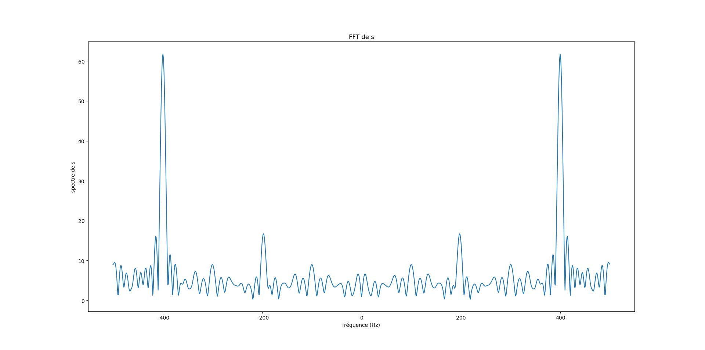

Contrairement à la FFT du signal porte, on retrouve la fréquence du signal carré au pic à 100Hz. Le signal carré est comme un signal sinusoïdales bruité. 

## Partie 3 : Débruitage d'un signal par FFT

### TF et TF inverse

On génère un signal sinusoïdal s de fréquence f = 10Hz, d'une durée de 1 seconde avec une fréquence d'échantillonage fe = 1kHz et d'amplitude 3 (on utilise la fonction numpy.sin). Comme précédemment, on fait varier t de 0 à 1 secondes. 

On obtient le signal suivant :  
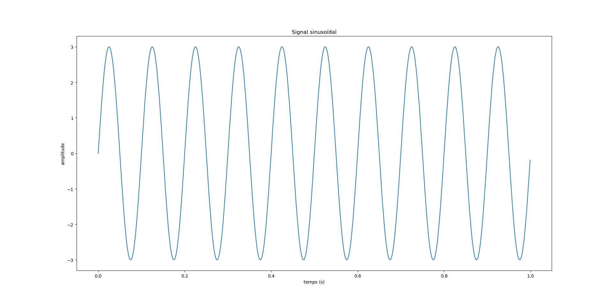

#### 1.

On calcule et on trace le module de la FFT du signal sinusoïdal :  
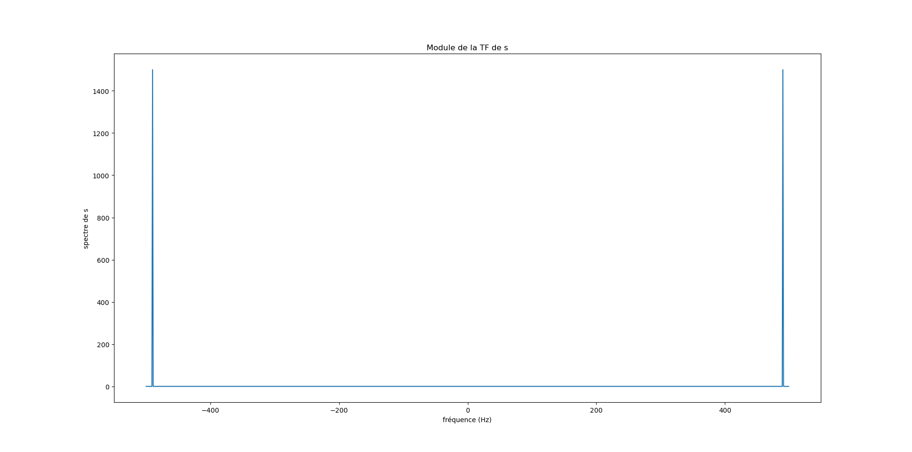

On observe un spectre très simple avec un pic à 10Hz.

#### 2.

On calcule et on trace la FFT inverse de la FFT du signal sinusoïdal :  
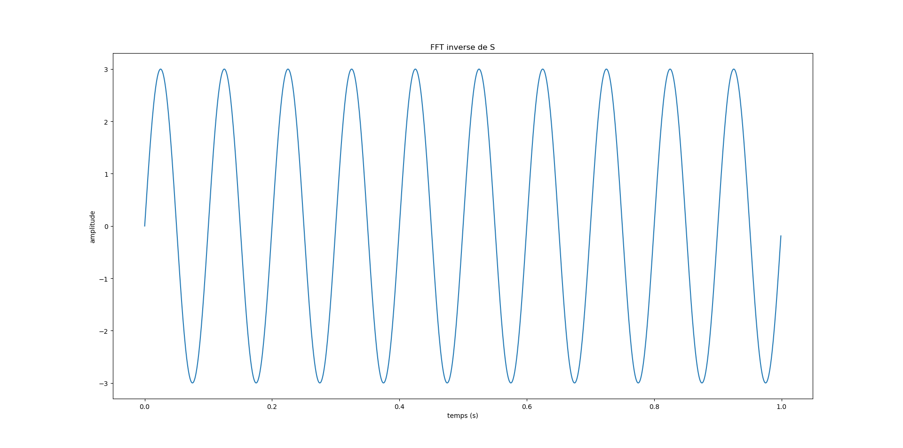

On obtient le même signal qu'au départ. On devine que pour débruiter un signal sinusoïdale simple il suffit d'enlever tous les autres pics d'intensité différente de celui à 10Hz.

### Bruit blanc

#### 3.

On génère, grâce à la fonction numpy.random.rand, un bruit blanc de même taille que le signal précédent. On trace le signal et son spectre :  

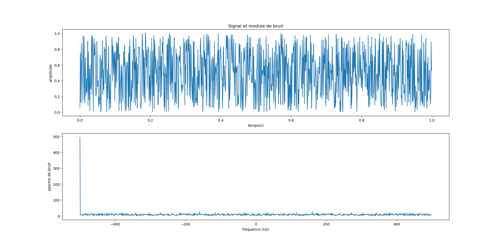
Le spectre du bruit est composé d'une quantité importante de fréquences, mais d'intensité relativement faible.

\newpage

### Bruitage du signal

#### 4.

On ajoute au signal initial un bruit blanc avec un ratio d'amplitude de 50% inférieur à celui du signal de départ. On trace le signal obtenu et son spectre :  
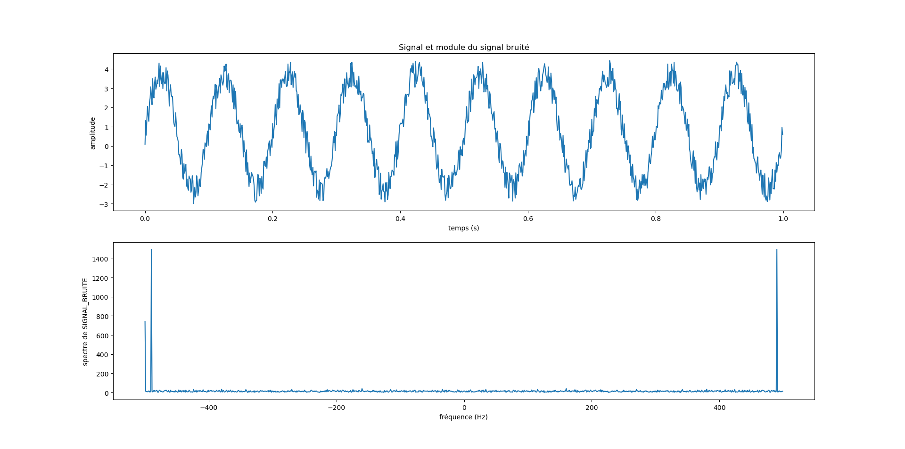

On obtient bien un signal bruité.

### Filtrage par FFT

On calcule l'amplitude maximale M de la transformée de Fourier. On définit un seuil S égal à 10%. On crée un filtre H comme ceci : 
$$
H =
\begin{cases}
0 \text{ si } |\text{TF[s]}| < S\times M \\
1 \text{ sinon }
\end{cases}
$$

\newpage

#### 5.

On applique le filtre H au signal bruité :  
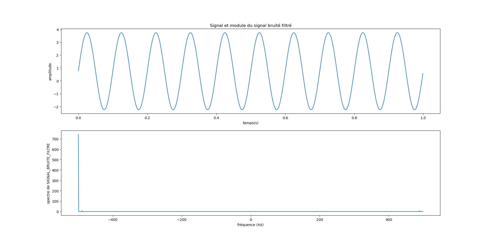

On a bien retrouvé le signal de départ comme attendu.

### Étude paramétrique

#### 6.

On recommence les simulations précédentes en faisant varier le seuil et le ratio d'amplitude entre le signal et le bruit. Si on choisit un seuil trop petit, le bruit n'est pas éliminé. Si on choisit un seuil trop grand, le signal est complètement éliminé. Plus le ratio est élevé, plus il est compliqué de filtrer le signal. Il semblerait que si le seuil est bien choisi le signal est toujours filtrable.

\newpage

#### 7.

On recommence les simulations avec un signal constitué de la somme de plusieurs sinusoïdes de différentes fréquences et intensités :  
$$s(t) = \cos(2f_1t) + 3 \cos(2f_2t) - 6\cos(2f_3t)$$

Avec $f_1 = 10\si{Hz}$, $f_2 = 55\si{Hz}$ et $f_3 = 122\si{Hz}$.

On obtient les courbes suivantes :  
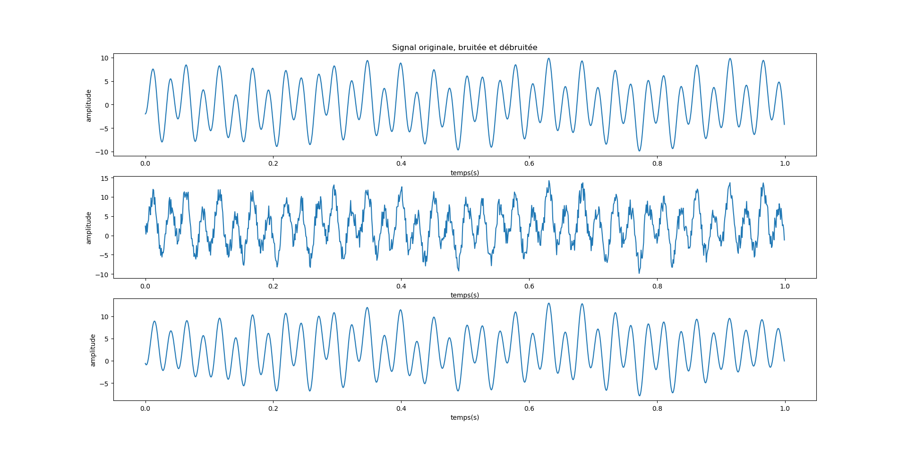

On arrive bien à débruiter le signal. On voit cependant qu'il est un peu modifié sur les bords.

# Conclusion

Pour conclure, nous avons vu dans cette initiation comment débruiter un signal. Il s'avère que cela est plutôt facile pour un signal simple (composé d'une seule sinusoïdale), alors que c'est plus compliqué pour un signal complexe (composé de plusieurs sinusoïdales).
