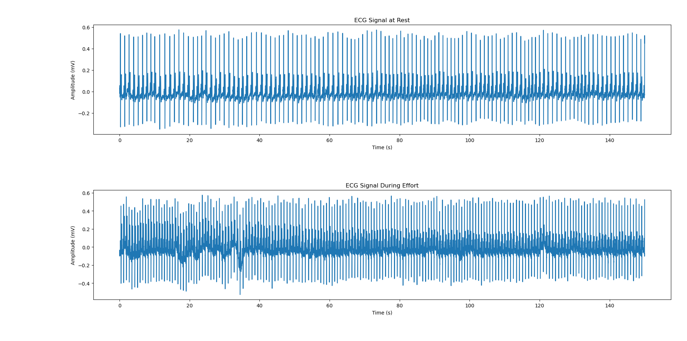
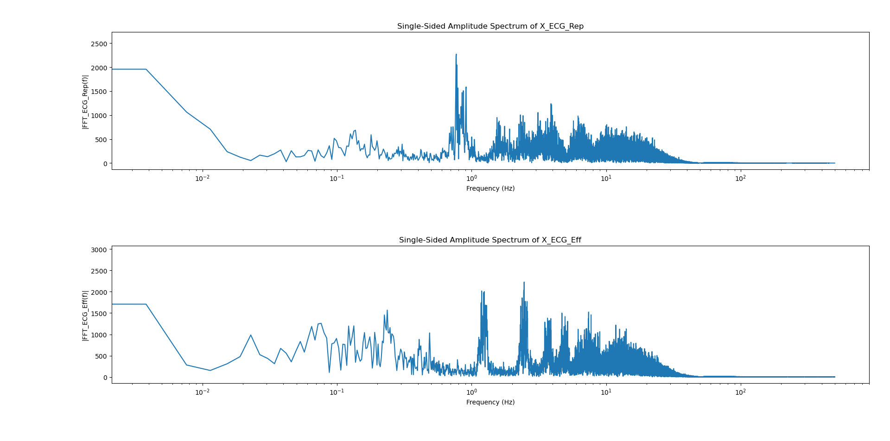
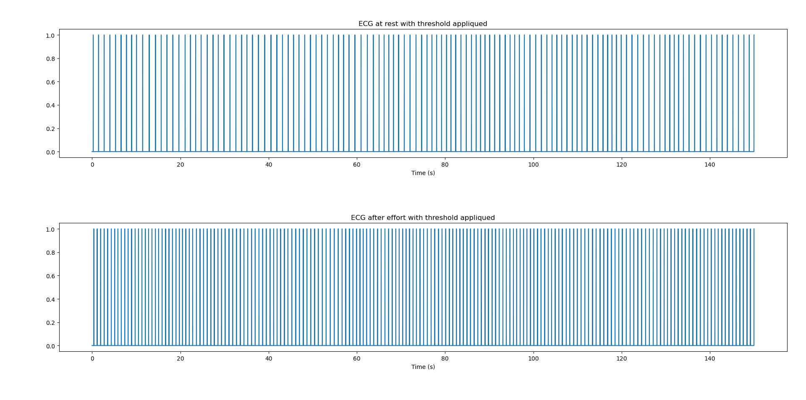
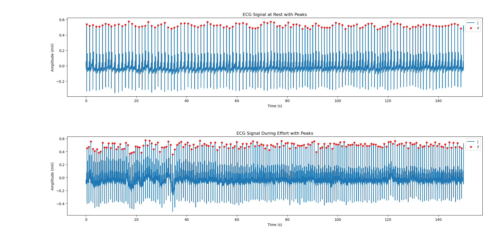
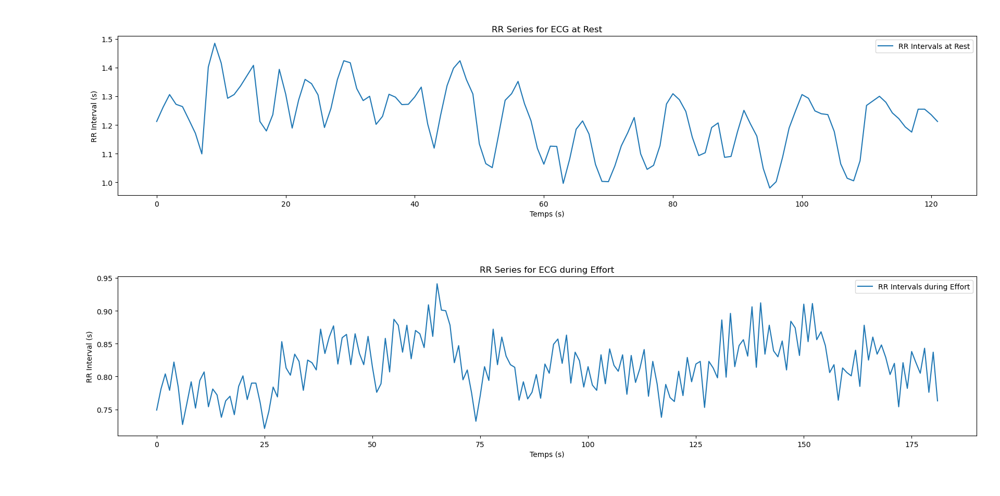
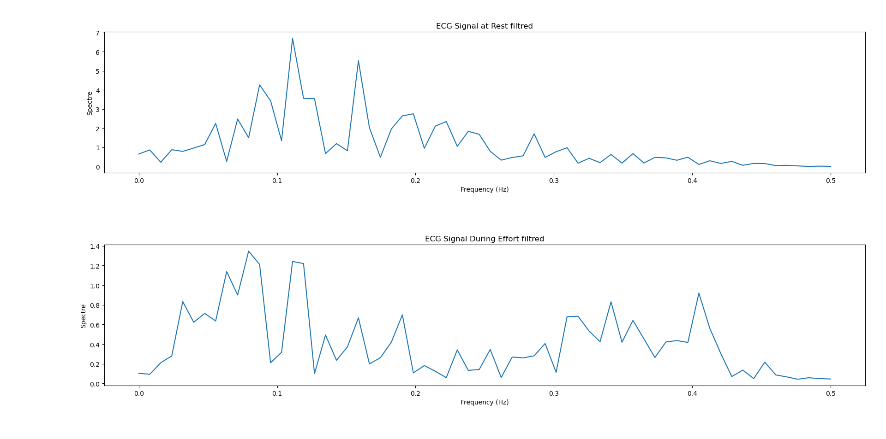
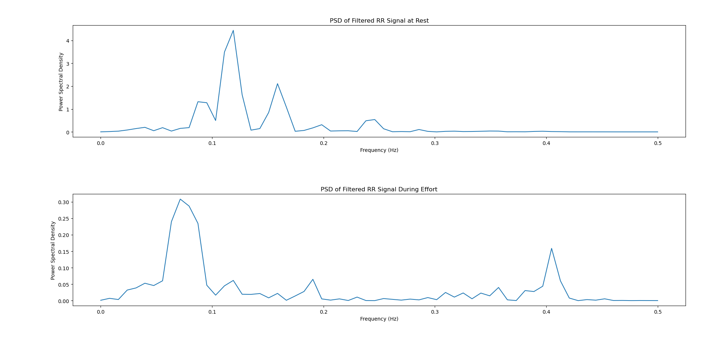

# Introduction

Dans ce TP, nous allons traiter des ECG d'un être humain à l'effort et au repos pour extraire les dynamiques du système nerveux autonome. Cela peut être utile pour étudier certaines maladies liées au Système Nerveux Autonome.

## 1.

On charge les données ECG, "ECG_TP_repos.mat" et "ECG_TP_effort.mat" avec scipy.io.loadmat.

## 2.

On affiche les deux signaux cardiaques sur une même figure :  

Comme on pouvait le deviner, le coeur bat plus vite durant l'effort qu'au repos.

## 3.

On calcule les spectres au repos et à l'effort. On affiche les deux spectres sur une demie-échelle fréquentielle :  

On voit que l'intensité est de manière générale plus élevée pour l'ECG à l'effort.

## 4.

### Étape 1

On détecte toutes les valeurs des signaux ECG qui sont supérieures à un $\text{seuil} = 0.6\text{max}(\text{ECG})$ (pris arbitrairement) :  

On remarque que les valeurs au dessus du seuil sont plus proches du seuil pour l'ECG à l'effort comparé à l'ECG au repos.

### Étape 2

On met à 1 toutes les valeurs supérieures au seuil et à 0 toutes les valeurs inférieures au seuil :  

On remarque immédiatement qu'il y a moins de bandes pour l'ECG au repos.

### Étape 3

Sur chaque plateau de 1, on trouve l'indice temporel de la valeur max des ECG :  

On voit encore qu'il y a plus de pics pour l'ECG à l'effort.

### Étape 4

On calcule la série temporelle RR de la fréquence cardiaque en utilisant numpy.diff :  

Les intervalles RR sont plus important pour l'ECG au repos que pour l'ECG à l'effort. 

## 5.

On affiche les demi-spectres des signaux filtrés sur 128 points :  

On obtient un résultat cohérent, l'amplitude max de l'ECG à l'effort est plus important que celle de l'ECG au repos.

\newpage

## 6.

On calcule la densité spectrale de puissance en prenant un nombre de bins fréquentiels égal à 128. On utilise la formule suivante :  

$$\text{PSD}(x) = |\text{FFT}[x.\text{hann}]|^2$$

Avec $x$ un signal et hann une fenêtre de Hanning de la longueur de $x$. On réutilise le même vecteur fréquence que précédemment.

On obtient la courbe suivante :  

On voit clairement que la densité spectrale est plus importante pour l'ECG à l'effort.

# Conclusion

Pour conclure, on obtient au final un résultat statisfaisant. Nous obtenons une densité spectrale de puissance totalement différente entre l'ECG à l'effort et au repos qui doivent correspondre aux dynamiques du SNAS et du SNAP.
