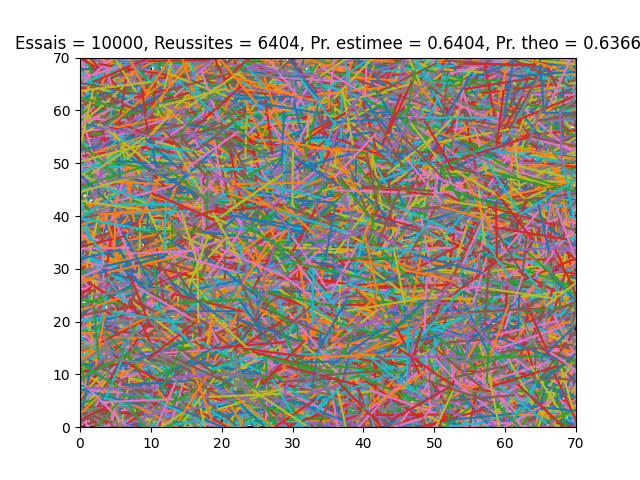

# Introduction

Dans ce TP, nous allons apprendre à manipuler Python et la librairie Numpy. Nous verrons ensuite comment simuler l'expérience aléatoire de l'aiguille de Buffon.

# A - Rapide introduction à Python

## 1.

On installe Anaconda et nous lançons Spyder.

## 2.

Nous allons voir comment importer de plusieurs manières un module python.

On enregistre un script Spyder sous le nom TP1_A. 

On importe le module numpy et on crée un vecteur de taille 10 rempli de zéros.

```python
import numpy
# Création d'un vecteur de zéros de taille 10
numpy.zeros(10)
```

On importe le module numpy sous le nom np et on fait la même chose que précédemment.

```python
import numpy as np
#Création d’un vecteur de zéros de taille 10
np.zeros(10)
```

On importe toutes les fonctions du module numpy et on appelle la fonction directement pour faire encore une fois la même chose que précédemment.

```python
from numpy import *
#Création d’un vecteur de zéros de taille 10
zeros(10)
```

## 3.

Nous voulons générer un vecteur x contenant N=100 réalisations indépendantes d'une variable aléatoire gaussienne de paramètres $m=0$, $\sigma = 1$.

On importe pour cela le module random inclut dans numpy et on utilise la fonction normal :

```python
import numpy as np
import numpy.random as rd
x = rd.normal(0,1,100)
```

On regarde la documentation de la fonction normal. Le premier paramètre correspond à M, le second paramètre correspond à $\sigma$ et le troisième argument correspond à la taille souhaitée.

```python
mat = rd.normal(10, 0.1, (5, 5))
```

On utilise la commande `mat.size`. On obtient le nombre total d'éléments qui est de 25.

On utilise la commande `mat.shape`. On obtient les dimensions de la matrice qui sont 5x5.

## 4.

On veut représenter les N réalisations contenues dans x.

On importe pour cela le module pyplot de matplotlib sous le nom plt :

```python
import matplotlib.pyplot as plt
```

On affiche une figure et on affiche le vecteur x dans cette figure :

```python
plt.figure()
plt.plot(x)
```

On rajoute un titre et un label aux axes du graphe :

```python
plt.title('Représentation du vecteur aléatoire x')
plt.xlabel('Indice du vecteur')
plt.ylabel('Valeur')
```

On obtient le graphe suivant :


## 5.

On veut représenter le vecteur x dans un histogramme, on exécute le code suivant :

```python
M=20
plt.figure()
plt.hist(x,M)
```

On obtient le graphe suivant :


On affiche l'histogramme des valeurs de x séparé en 20 barres.

On rajoute les lignes en dessous et on relance :

```python
pas = 0.1
bins = np.arange(-3,3,pas)
plt.figure()
plt.hist(x,bins)
```

On obtient le graphe suivant :


On affiche le même histogramme entre -3 et 3 avec un pas de 0.1 entre chaque barre.

## 6.

On veut interpréter l'histogramme de x en le comparant avec la densité de probabilité de formule :

$$P_X(x) = \frac{1}{\sigma \sqrt{2\pi}} \exp(-\frac{1}{2\sigma^2}(x - m)^2)$$

On va calculer la densité de probabilité de 2 manières différentes. On utilisera d'abord une version itérative puis une version vectorisée.

### Version itérative

On utilise le code suivant pour calculer la densité de probabilité itérativement :

```python
x_px=np.arange(-3, 3, 0.05)
px=np.zeros(x_px.size)
for i in range(px.size):
    px[i]=1/(sig*np.sqrt(2*np.pi))*np.exp(-1/(2*sig**2)*(x_px[i]-m)**2)
```

On affiche la figure avec l'histogramme et la courbe de densité :


### Version vectorisée

On déclare le vecteur px à l'aide de deux lignes :

```python
x_px = np.arange(-3, 3, 0,05)
px = 1/(sig*sqrt(2*np.pi))*np.exp(-1/(2*sig**2)*(x_px - m)**2)
```

On affiche la figure avec l'histogramme et la courbe de densité :


On obtient bien les 2 mêmes graphes.

On rajoute dans les commandes `hist` le paramètre `density = True` :


On constate que les courbes de la densité et l'histogramme sont alignés. Ce paramètre ramène les hauteurs des batons de l'histogramme à la courbe de densité.

\newpage

# B - L'aiguille de Buffon

L'aiguille de Buffon est une expérience consistant à lancer k fois un baton de taille L dans un carré de taille N*a dans lequel on trace N lignes horizontales écartées de a. On note l'évenement E : Le baton croise les côtés du carré ou croise une des N lignes dans le carré.

Pour $L \le a$, on peut montrer que $P(E) = \frac{2L}{\pi a}$.

## 1.

On complète le fichier 'TP1_1.py' permettant de simuler cette expérience et de la visualiser géomètriquement. On cherche à calculer numériquement une approximation de $P(E) = f_r(k) = \frac{N_R(k)}{k}$ avec $N_R(k)$ le nombre de fois où l'événement E est réalisé au cours des k premiers essais. 

On teste le script avec les valeurs par défaut $a = L = 1$, $N = 7$ et on prend un nombre d'essai $k = 100$. On obtient les graphes suivants :


On obtient une probabilité estimée de 0.63 qui est plutôt proche de la valeur théorique qui est de 0.6366.

On teste à nouveau le script pour un nombre d'essai $k = 10000$. On obtient les graphes suivants :




On obtient une probabilité estimée de 0.6404 qui est aussi proche de la valeur théorique de 0.6366.

## 2.

On prend N = 8, pour avoir N pair. On rajoute N/2 lignes verticales espacées de 2a. On note F l'événement : "la baton touche au moins 1 des lignes verticales". On cherche donc à estimer $P(E\cup F) = P(E) + P(F) - P(E\cap F)$. Ici, on suppose que E et F sont indépendants, donc $P(E\cap F) = P(E) \times P(F)$. Finalement, $P(E\cup F) = P(E) + P(F) - P(E) \times P(F) = \frac{2L}{\pi a} + \frac{L}{\pi a} - \frac{2L^2}{\pi^2 a^2} = 0.7523$. On enregistre le nouveau fichier sous le nom 'TP1_2.py'

On teste notre script avec les valeurs $N = 8$, $L = a = 1$ et $k = 100$. On obtient les graphes suivants :  


On obtient 0.69. On remarque que la probabilité estimée est plus haute que précédemment. Cela est parfaitement logique car on rajoute des lignes et il y a donc plus de chance que les batons touchent une ligne. On trouve toujours une probabilité expérimentale relativement éloignée de la valeur théorique.

On teste à nouveau notre script avec les valeurs $N = 8$, $L = a = 1$ et $k = 10000$. On obtient les graphes suivants :


La probabilité expérimentale est encore une fois différente de la proba théorique (on obtient 0.799). Cela s'explique sûrement par le fait que les événements E et F ne sont pas réellement indépendants car quand un baton touche une ligne verticale, il a plus de chance de toucher une ligne horizontale et inversement.

## 3.

On remplace l'aiguille par un anneau de diamètre L et de centre M. On fixe le point M sur la droite $x = \frac{Na}{2}$ et on répartit les anneaux uniformément sur l'axe des y tel que $0\le y \le Na$. La probabilité que l'anneau touche une ligne sur cette axe est $P(A) = \frac{L}{a}$. On enregistre notre nouveau fichier sous le nom 'TP1_3.py'.

On teste notre script avec les valeurs par défaut : $L = a = 1$. On obtient les graphes suivants :  


La probabilité estimée est de 1 ce qui est normal car tous les anneaux touchent au moins 1 ligne.

On teste notre script pour $a = 1$ et $L = \frac{a}{2} = 0.5$. On obtient les graphes suivants :


On trouve une probabilité estimée de 0.5 qui est exactement la même que la probabilité théorique.

On a $P(A) = \frac{L}{a}$. Si on nomme E l'événement : "le baton touche une des lignes horizontales" et A l'événement : "l'anneau touche une des lignes horizontales", on a : $P(E) = \frac{2}{\pi} \times P(A)$

## 4.

Dans cette partie, nous allons interpréter les résultats en calculant l'écart-type et l'erreur.

### Aiguille de Buffon (lignes horizontales)

#### 100 essais :

$e = |0.63 - 0.6366| = 0.0066$

$\sigma = \sqrt{\frac{0.6366\times(1-0.6366)}{100}} = 0.0481$

L'erreur est bien inférieure à l'écart-type donc les résultats sont corrects.

#### 10000 essais :

$e = |0.6404 - 0.6366| = 0.0038$

$\sigma = \sqrt{\frac{0.6366\times(1-0.6366)}{10000}} = 0.0048$

L'erreur est toujours bien inférieure à l'écart-type donc les résultats sont corrects.

### Aiguille de Buffon (lignes horizontales et verticales)

#### 100 essais :

$e = |0.69 - 0.7523| = 0.0623$

$\sigma = \sqrt{\frac{0.7523\times(1-0.7523)}{100}} = 0.0432$

L'erreur est supérieure à l'écart-type donc les résultats sont incorrects.

#### 10000 essais :

$e = |0.799 - 0.7523| = 0.0467$

$\sigma = \sqrt{\frac{0.7523\times(1-0.7523)}{10000}} = 0.0043$

L'erreur est toujours supérieure à l'écart-type donc les résultats sont incorrects.

Comme expliqué dans le 2, les résultats sont mauvais car la probabilité théorique est mal calculée.

### 3.

#### 100 essais :

$e = |1 - 1| = 0$

$\sigma = \sqrt{\frac{1\times(1-1)}{100}} = 0$

L'erreur est nulle donc le résultat est exact.

#### 10000 essais :

$e = |0.5 - 0.5| = 0$

$\sigma = \sqrt{\frac{0.5\times(1-0.5)}{100}} = 0.0025$

L'erreur est nulle donc le résultat est exact.

# Conclusion

Pour conclure, nous avons revu comment utiliser les modules numpy et pyplot de python et nous avons simulé l'expérience aléatoire appelée 'Aiguille de Buffon'. Nous avons remarqué la convergence de la probabilité expérimentale vers la probabilité théorique pour l'expérience de l'aiguille de Buffon. Avec des variantes de cette expérience la probabilité théorique change beaucoup comme lorsqu'on rajoute des lignes verticales en plus des lignes horizontales. Nous avons aussi pu observer que lorsqu'on répartit de manière uniforme des points impliqués dans une expérience de loi uniforme, on obtient exactement la probabilité théorique (cas des anneaux).
