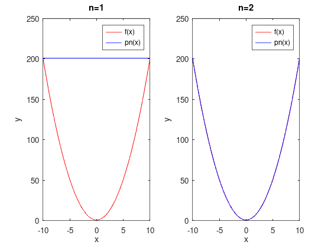
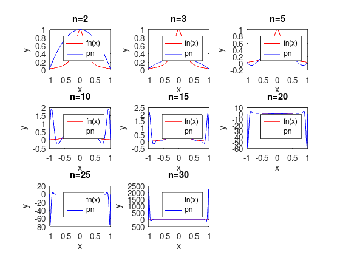
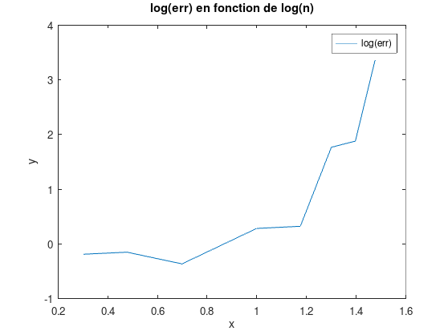
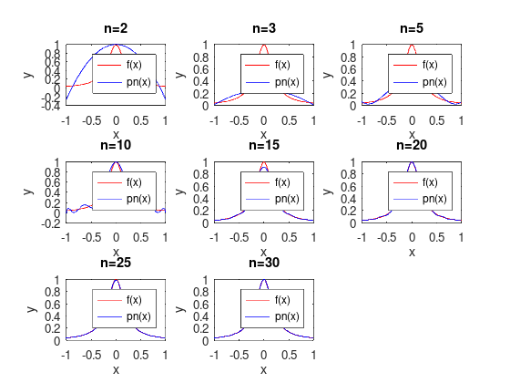
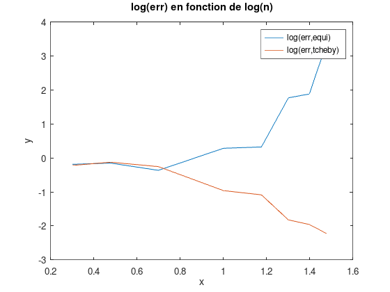
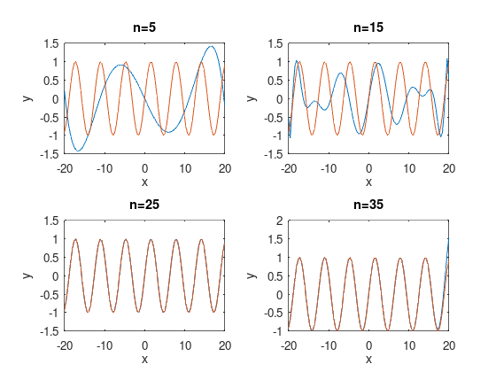
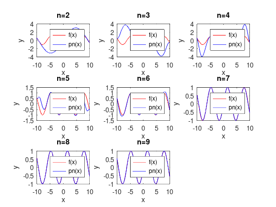
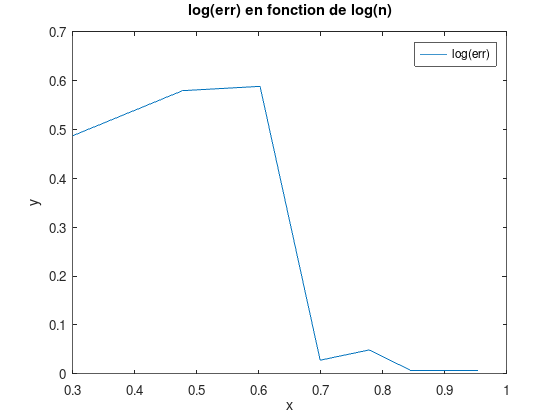

# Introduction

Dans ce TP, nous allons voir comment interpoler une fonction avec un polynôme par le biais de l'interpolation de Lagrange.

## 1. Interpolation de Lagrange

### 1.

On crée la fonction polyLagrange(x,y), qui retourne $p_n(x)$, le polynôme obtenu par l'interpolation de Lagrange à partir des coordonnées des $n + 1$ points d'interpolation ($x_i$, $y_i$).

On utilise la formule :  
$$p_n(x) = \sum_{i=0}^n f(x_i) \prod_{j=0, i\neq j}^n \frac{x-x_j}{x_i - x_j}$$

### 2.

On crée un script test1.m et on teste la fonction polyLagrange sur une fonction polynomiale ($f(x) = x^2 + 1$)

On affiche la courbe de la fonction choisie et de son polynome interpolateur:

On remarque que l'interpolation est exacte si l'on a assez de points.

## 2. Points équidistants et effet Runge

Soit la fonction $f(x) = \frac{1}{1 + 25x^2}$ dont on souhaite étudier l'efficacité de l'interpolation de Lagrange ainsi qu'identifier ses potentielles faiblesse sur l'intervalle [-1, 1]. On choisit n + 1 points d'interpolation équidistants.

On crée un nouveau script test2.m qui aura pour but d'étudier l'erreur d'interpolation en fonction de n.

### 1.

On représente la fonction f et le résultat de notre interpolation $p_n(x)$ pour différentes valeurs de n :  

Lorsque n augmente, le polynôme interpolateur se rapproche généralement de la courbe réelle mais à certains endroits le résultat est aberrant. Ce phénomène est dû à l'effet de Runge.

### 2.

On représente dans une autre figure le logarithme de l'erreur de notre interpolation ($\log_{10}||f(x)-p_n(x)||_\infty$) en fonction du logarithme de n :  

On remarque que l'erreur diminue pour des n croissants petits. Elle se met à augmenter drastiquement à un certain rang. On utilisera les points de Tchebychev. Cette technique permet que l'erreur converge vers 0.

## 3. Points de Tchebychev

### 1.

On crée la fonction tchebyPoints(a, b, n) qui retourne les n+1 points de Tchebychev dans l'intervalle $[a, b]$.

### 2.

On teste notre fonction tchebyPoints(a, b, n) pour différentes valeurs de a, b et n. Elle semble fonctionner.

### 3.

On crée un nouveau script test3.m dans lequel on représente la fonction f(x) et le résultat de notre interpolation p_n(x) utilisant les points de Tchebychev pour différentes valeurs de n :  

Lorsque n augmente on ne constate pas le même phénomène que pour le cas de points équidistants.

### 4.

On représente dans une autre figure en fonction du logarithme de n, le logarithme de l'erreur de nos interpolations en choisissant des points d'interpolation équidistants et les points de Tchebychev :

On remarque que l'erreur tend à converger vers 0 avec les points de Tchebychev contrairement aux points équidistants.

## 4. Problèmes facultatifs

### Problème 1

On calcule le polynome de Lagrange avec les points de Tchebychev pour des valeurs de n différentes :

Pour n=25, on a $-1.9406\cdot 10^{-4}x^7 + -1.9649\cdot 10^{-17}x^6 +  8.2558\cdot 10^{-3}x^5 + -1.6182\cdot 10^{-16}x^4 + -1.6612\cdot 10^{-1}x^3  + 1.8822\cdot 10^{-16}x^2  + 9.9935\cdot 10^{-1}x + -3.5258\cdot 10^{-16}$

On semble se rapprocher de plus en plus du développement de Taylor de sin(x) :

$$sin(x) = \frac{x}{1!} + \frac{x^3}{3!} + \frac{x^5}{5!} + \frac{x^7}{7!} + \cdots$$

### Problème 2

L'interpolation d'Hermite est une extension de l'interpolation de Lagrange. Le polynôme construit est interpolateur (il passe par tous les points spécifiés) et osculateur (la dérivée en chaque point spécifié est l même que pour la fonction). Cette méthode permet notamment d'éviter le phénomène de Runge.

Pour calculer le polynôme d'Hermite il faut d'abord calculer les $L_i(x)$. On peut ensuite calculer le polynôme d'interpolation :

$$p_n = \sum_{i=0}^n f(x_i)H_i(x) + f'(x_i)K_i(x)$$

où $H_i(x)=(1-2L_i'(x_i)(x-x_i))L_i^2(x)$ et $K_i(x)=(x-x_i)L_i^2(x)$.

### Problème 3

On implémente l'interpolation d'Hermite et on enregistre la fonction dans le fichier polyHermite.m. On affiche sur un même graphique la fonction $\sin(x)$ et le résultat de notre interpolation $p_n(x)$ pour différentes valeurs de n :  

L'interpolation d'Hermite semble rapidement converger.

On affiche sur un graphe le logarithme de l'erreur en fonction du logarithme de n :

L'erreur baisse très vite.

### Problème 5

On modifie la fonction polyLagrange de sorte à ce qu'elle reçoive en argument x, les abscisses des points d'interpolation et f, la fonction à interpoler. Il suffit de recalculer les images des points d'interpolation avec la fonction f au début du programme. On enregistre la fonction sous le nom polyLagrange1.

# Conclusion

Pour conclure, nous avons implémenté l'interpolation de Lagrange et avons pu vérifier son bon fonctionnement. Nous avons notamment observé que cette méthode marche parfaitement pour un polynôme si le nombres de points est suffisant. Elle fonctionne également très bien lorsque la fonction à interpoler utilise les points de Tchebychev.

# Suggestions pour les améliorations du TP

Il serait intéressant d'avoir fait les TD avant les TP notamment quand il est écrit dans le sujet de se référer au TD pour faire les exercices.
