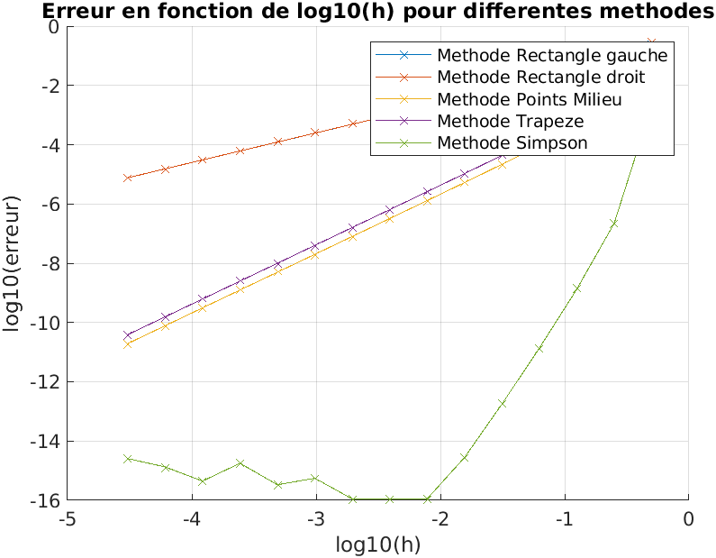
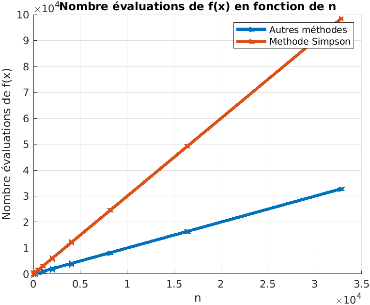
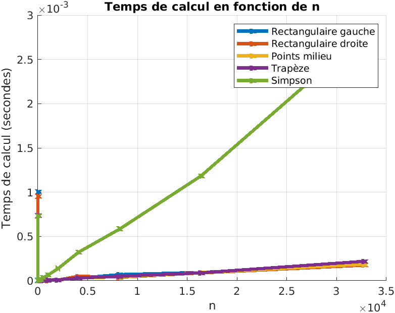

# Introduction

Dans ce TP, nous allons étudier différentes méthodes pour calculer numériquement des intégrales.

## 1. Objectifs

L'objectif de ce TP est d'approcher numériquement l'intégrale suivante :  
$$I = \int_a^b f(x)dx, \text{ avec } f(x) = \frac{1}{x^2 + 1}$$

## 2. Méthodes de quadrature

Soit $h = \frac{b-a}{n}$.

### 1. Méthode des rectangles à gauche

On crée la fonction $\text{intRectG}(f, a, b, n)$.

On utilise la formule : $Î = h\sum_{i=0}^{n-1}f(x_i)$

### 2. Méthode des rectangles à droite

On crée la fonction $\text{intRectD}(f, a, b, n)$.

On utilise la formule : $Î = h\sum_{i=0}^{n-1}f(x_{i+1})$

### 3. Méthode des points milieux

On crée la fonction $\text{intPointsM}(f, a, b, n)$.

On utilise la formule : $Î = h\sum_{i=0}^{n-1}f(\frac{x_i + x_{i+1}}{2})$

### 4. Méthode des trapèzes

On crée la fonction $\text{intTrap}(f, a, b, n)$.

On utilise la formule : $Î = h (\frac{f(a) + f(b)}{2} + \sum_{i=1}^{n-1}f(x_i))$

### 5. Méthode de Simpson

On crée la fonction $\text{intSimpson}(f, a, b, n)$.

On utilise la formule : $Î = \frac{h}{3} (f(a) + f(b) + 4\sum_{i=0}^{\frac{n}{2}-1}f(x_{2i+1}) + 2\sum_{i=0}^{\frac{n}{2}-1}f(x_{2i}))$

## 3. Étude de convergence

On crée un script test1.m qui a pour but d’étudier la convergence des cinq méthodes de quadrature considérées.

### 1.

On calcule analytiquement l'expression de $I = \int_a^b f(x)dx$ :

\begin{align*}
I &= \int_a^b f(x)dx \\
&= \int_0^1 \frac{1}{x^2 + 1}dx \\
&= [arctan(x)]_0^1 \\
&= arctan(1) - arctan(0) \\
&= \pi/4
\end{align*}

### 2.

On représente dans une figure le logarithme de l’erreur de la quadrature pour les cinq méthodes en fonction du logarithme de h :

## 4. Étude de performance

On crée un script test2.m qui a pour but d’étudier la performance des cinq méthodes de quadrature considérées.

### 1.

On représente dans une figure le nombre d’évaluation de f(x) réalisées en fonction de n pour les 5 méthodes.

### 2.

On représente dans une autre figure le temps de calcul en fonction de n pour les 5 méthodes :

## 5. Conclusion

### 1.

D'après les résultats des études de convergence et de performance, la méthode de Simpson semble être la plus appropriée pour la fonction $f(x)=\frac{1}{x^2 + 1}$. En effet, cette méthode offre une convergence plus rapide par rapport aux autres méthodes, notamment les rectangles et les trapèzes. Le temps de calcul de la méthode de Simpson reste raisonnable par rapport à l'amélioration significative de la précision.

### 2.

On trouve deux fonctions $g(x)$ et $h(x)$ tel que les méthodes de quadrature optimales respectives, en termes de convergence et de performance, soient différentes de celle trouvée pour la fonction $f(x)$ :

$g(x)=42$ est une fonction constante, l'utilisation de la méthode des rectangles gauches notamment permettrait d’obtenir une erreur nulle

$h(x)=80085-42x$ est une fonction affine, l'utilisation de la méthode des rectangles milieux permettrait d’obtenir une erreur nulle

# Conclusion

L'objectif de ce TP était d'approcher numériquement l'intégrale de la fonction $f(x)=\frac{1}{x^2 + 1}$ à l'aide de différentes méthodes de quadrature. Après avoir comparé les méthodes des rectangles, des points milieux, des trapèzes et de Simpson, nous avons observé que chacune présente des avantages selon le nombre de sous-intervalles et la précision souhaitée. En général, la méthode de Simpson a donné les meilleurs résultats, tant en termes de précision que d'efficacité, mais d'autres méthodes peuvent être préférables selon les caractéristiques de la fonction à intégrer.

# Suggestions pour les améliorations du TP

Il serait intéressant d'avoir fait les TD avant les TP notamment quand il est écrit dans le sujet de se référer au TD pour faire les exercices.
